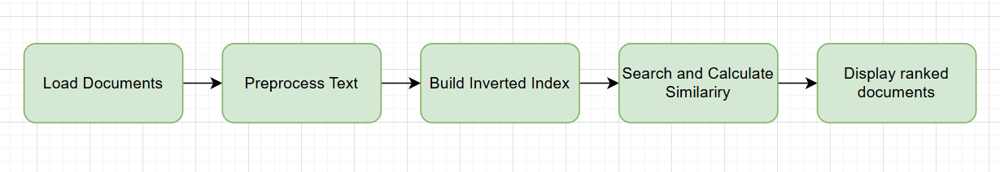

# README – Enhanced TF-IDF Search Engine in Python

This project demonstrates a **simple yet more configurable information retrieval system** using Python and NLTK. It provides:

1. **Multiple TF-IDF weighting schemes** (binary, raw, log).  
2. **Multiple IDF schemes** (none, standard, probabilistic).  
3. **Multiple similarity measures** (cosine, Jaccard, Dice).  
4. **Flexible search** with a command-line interface (CLI) specifying TF, IDF, similarity, and number of top results.  
5. **Evaluation** through precision/recall, F1, and P@K metrics (with user-defined relevant documents).

---

## Table of Contents

1. [Prerequisites](#prerequisites)  
2. [Project Structure](#project-structure)  
3. [How It Works](#how-it-works)  
   1. [Reading Documents](#reading-documents)  
   2. [Preprocessing](#preprocessing)  
   3. [Building the Inverted Index](#building-the-inverted-index)  
   4. [Weighting and Building Vectors (TF–IDF)](#weighting-and-building-vectors-tfidf)  
   5. [Similarity and Searching](#similarity-and-searching)  
   6. [Evaluation](#evaluation)  
4. [Usage](#usage)  
5. [Customization](#customization)  
6. [Possible Improvements](#possible-improvements)  
7. [License](#license)

---

## Prerequisites

- **Python 3.7+**  
- **NLTK** (Natural Language Toolkit). Install with:
  ```bash
  pip install nltk
---

## Prerequisites

- **Python 3.7+** (earlier versions may work, but are not tested)
- **NLTK** (Natural Language Toolkit). To install it:

  ```bash
  pip install nltk
  ```

---

Additionally, download the necessary NLTK data:

```python
import nltk
nltk.download('punkt')
nltk.download('stopwords')
```

---

## Project Structure

```plaintext
project-folder/
├── documents/               # Directory containing .txt files
├── main.py                  # Main script
├── README.md                # Documentation
```

---

## How It Works

### 1. Reading Documents

- Recursively scans a directory for `.txt` files.
- Loads their content into a structured list of documents with unique IDs.

### 2. Preprocessing

- Converts text to lowercase.
- Tokenizes text using NLTK.
- Removes stopwords and non-alphabetic tokens.
- Applies stemming to reduce words to their base forms.

### 3. Building the Inverted Index

- Maps terms to the documents in which they appear.
- Tracks the frequency of each term in each document.

### 4. Weighting and Building Vectors (TF–IDF)

-	TF can be binary, raw frequency, or log frequency (chosen via --tf).
-	IDF can be none, standard, or probabilistic (chosen via --idf).
-	Produces a weighted_index and doc_vectors for efficient scoring.

### 5. Similarity and Searching

- The user query is preprocessed and weighted (using the same TF/IDF schemes).
- Similarity can be one of:
	•	Cosine (--sim cosine)
	•	Jaccard (--sim jaccard)
	•	Dice (--sim dice)
- Ranks documents by similarity score and returns top results.

Below is a visual representation of the workflow:

## 

## Usage

1.	Place your .txt files in the documents/ folder (or specify another folder).

2.	Run the script with command-line arguments to control TF scheme, IDF scheme, similarity, etc.
Exemple:
```bash
python main.py \
    --query "information retrieval" \
    --documents "./documents" \
    --tf l \
    --idf t \
    --sim cosine \
    --topk 10
```

Explanation:
	•	--query        : The search query text.
	•	--documents    : Path to a folder of .txt files.
	•	--tf           : TF scheme (b, n, or l).
	•	--idf          : IDF scheme (n, t, or p).
	•	--sim          : Similarity measure (cosine, jaccard, or dice).
	•	--topk         : Number of top documents to display and evaluate (default=5).


3. Relevant Documents: By default, the code uses a placeholder set, e.g. {"doc_3", "doc_5", "doc_7"}.
	•	For accurate evaluation, you should specify query-specific relevant docs. This can be done by either:
	•	Hardcoding a dictionary mapping queries to relevant doc IDs.
	•	Loading an external relevance-judgment file.
	•	Update the relevant docs in main.py if needed.

4. Sample Output :

```plaintext
Loading documents from: ./documents
Number of documents loaded: 10
Building inverted index...
Building weighted index (TF='l', IDF='t')...

Query: "information retrieval" (TF='l', IDF='t', SIM='cosine')
Top 5 results:
  doc_2 => 0.1174
  doc_7 => 0.0982
  doc_0 => 0.0761
  doc_9 => 0.0528
  doc_1 => 0.0443

--- Evaluation Metrics ---
Global Precision: 0.33
Global Recall:    0.50
Global F1:        0.40
P@5:              0.40
R@5:              0.60
```

---

## Customization

- **Stopwords Language**: Change the `LANGUAGE` variable to use a different stopwords list (e.g., "french").
- **Stemming**: Swap out the `SnowballStemmer` for a different stemming algorithm if needed.
- **Directory Path**: Modify the `folder_path` variable in `main.py` to point to your desired directory.
- **Relevance Judgments**: Modify or load from a file to reflect actual relevant docs for each query.
- **Additional Similarity Metrics**: You can add more advanced similarity measures if desired.

---

## Possible Improvements

- Add support for multiple file formats (e.g., `.pdf`, `.docx`).
- Implement query expansion techniques to improve search results.
- Use advanced NLP techniques such as lemmatization instead of stemming.
- Optimize performance for large document sets using parallel processing.

---

## License

This project is licensed under the MIT License. You are free to use, modify, and distribute the code as long as proper attribution is given.
